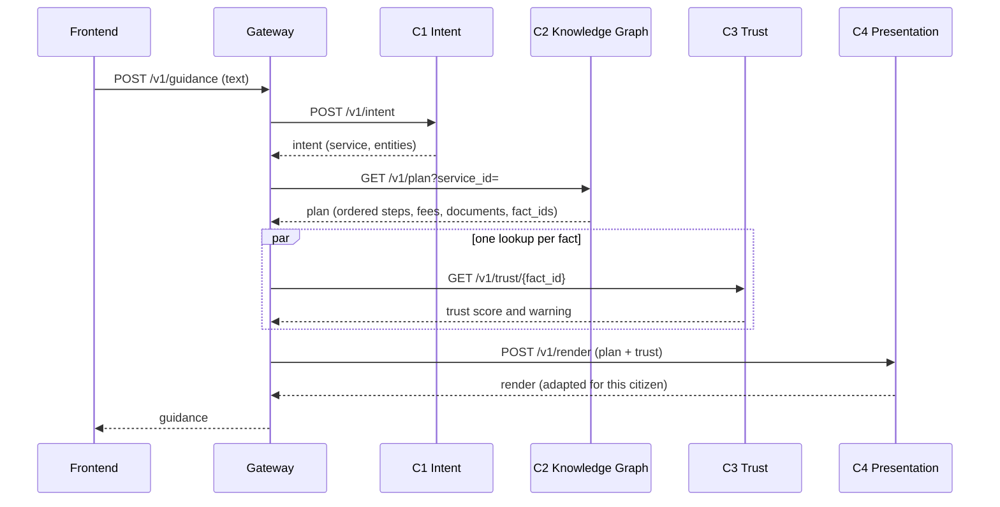
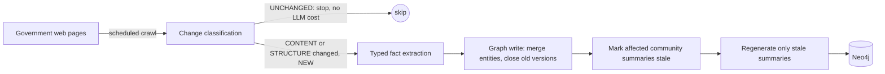
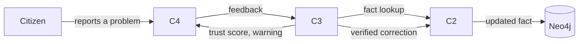

# HelaGuide

**AI-Driven Citizen-Service Orchestrator for Urban Sri Lanka**
Project J26-SE-354 · Faculty of Computing, Sri Lanka Institute of Information Technology

A citizen asks, in Sinhala, English or a mix of both, how to get something done. HelaGuide
works out which government services are involved, puts them in the order they have to be
completed, warns where a published fact is disputed, and presents the steps in a way that
suits that person. Every fee and requirement it shows is kept current with the agencies'
own published pages and can be traced back to the page it came from.

---

## Contents

1. [The problem](#1-the-problem)
2. [Existing solutions and their limits](#2-existing-solutions-and-their-limits)
3. [What HelaGuide does](#3-what-helaguide-does)
4. [How the system works](#4-how-the-system-works)
5. [The four components](#5-the-four-components)
6. [Shared interface contract](#6-shared-interface-contract)
7. [Data, privacy and ethics](#7-data-privacy-and-ethics)
8. [Technology stack](#8-technology-stack)
9. [Repository layout](#9-repository-layout)
10. [Getting started](#10-getting-started)
11. [Project status](#11-project-status)
12. [Commercialization](#12-commercialization)
13. [Team](#13-team)

---

## 1. The problem

Public administration in Sri Lanka is delivered by many independently run agencies. A
citizen who wants one outcome, such as a passport, a business registration or a land
transfer, is rarely dealing with one service. They are dealing with a chain of services
that must be completed in a fixed order at different agencies, where each step needs a
document produced by an earlier one. An ordinary passport needs a birth certificate and a
National Identity Card first; a replacement for a lost passport also needs a police report.

The information is public but it is:

- **Unstructured.** Fees, documents and prerequisites exist only as prose across dozens
  of separately maintained agency websites, in inconsistent formats, some inside PDFs.
- **Unordered.** No page states which service depends on which. Applicants find a missing
  prerequisite only when they are turned away at the counter.
- **Unstable.** Fees are revised and documents added without notice. Published guidance
  goes out of date silently, and nothing flags it.
- **Hard to ask about.** Citizens naturally mix Sinhala and English in one sentence, and
  current channels treat every message on its own, so people repeat themselves.
- **One size fits all.** Every citizen gets the same presentation, whether they have done
  the procedure before or have never dealt with a government office.

The Government Information Centre (GIC-1919) handles in the order of 1.8 million enquiry
calls a year, a large share of them questions about cost, documents and what must be done
first. The central service catalogue on the GIC portal was observed listing no services
at all, twice, four weeks apart.

**Who is affected:** citizens (lost time, repeated office visits, which hit hardest those
who cannot easily take leave from work), government agencies and contact centres (avoidable
enquiry volume), and intermediaries such as company-formation agents and immigration
consultants who navigate these procedures for clients.

## 2. Existing solutions and their limits

| Approach | Limitation |
|---|---|
| Government information portals (GIC) | The citizen must find the right service; no cross-agency journey is assembled from a natural-language request; gaps are not signalled. |
| Domain chatbots (Ministry of Education AI chatbot, Nov 2025) | Scoped to one domain; no multi-ministry workflows. |
| Integrated national platforms (Singapore LifeSG, Estonia Bürokratt) | Depend on deep government integration and a national digital identity Sri Lanka does not have in equivalent form; Bürokratt does not produce full procedural workflows. |
| General-purpose RAG over agency pages | Retrieves by similarity, so the prerequisite page (which never mentions the target service) is missed, and similarity carries no notion of order. |
| One-stop government models (GovML) | Describe each service on its own; no prerequisite relationships; not maintained automatically from live sources. |
| Incremental GraphRAG methods | Regenerate summaries only on structural change. A fee corrected in place changes no structure, so the old value keeps being served. |

## 3. What HelaGuide does

HelaGuide is four research components behind one gateway:

| | Component | What it solves |
|---|---|---|
| **C1** | Multilingual Conversational Intent and Entity Understanding | Understands Sinhala-English code-switched requests across a multi-turn conversation, at a controlled token and latency cost. |
| **C2** | Knowledge Graph and Service Orchestration | Builds and maintains a live graph of government services from official pages, and turns a request into a dependency-ordered, multi-agency plan. |
| **C3** | Civic Trust and Knowledge Verification | Uses post-visit citizen feedback to score how reliable each fact currently is, defends against false or coordinated reports, and sends verified corrections back to the graph. |
| **C4** | Context-Aware Adaptive Guidance Presentation | Chooses how much explanation, structure and guidance to show for this citizen and this procedure, and learns from how people interact with it. |

Together they answer the question citizens actually ask, *"what do I do, and in what
order?"*, with facts that are current, traceable to their source, and marked when disputed.

## 4. How the system works

### 4.1 A citizen request



### 4.2 Keeping the knowledge current



### 4.3 The feedback loop



### 4.4 Who talks to whom

| Component | Takes in | Gives out |
|---|---|---|
| **C1** | Raw citizen text | `intent`: the identified service and entities |
| **C2** | `intent`; government pages; `correction` | `plan`: ordered steps with agency, fee, documents; `fact` lookups |
| **C3** | `feedback`; `fact` | `trust` score per fact; `correction` when verified |
| **C4** | `plan` + `trust` + behavioural signals | `render`: the plan adapted for this citizen; `feedback` |

## 5. The four components

### C1 · Multilingual Conversational Intent and Entity Understanding Engine

**Owner:** Dabarera W. A. S. · **Folder:** [`components/c1-intent`](components/c1-intent) · **Port:** 8001

**Problem.** Citizens mix Sinhala and English in the same sentence. No existing system
parses this code-switched input into structured intent, and current channels treat each
message in isolation, so nothing carries intent and entities across the turns of a
conversation. General-purpose LLMs are untested for this combination at national scale,
where token cost and latency matter.

**Objective.** A multilingual conversational engine that understands Sinhala-English
requests across multi-turn dialogue, treating token usage, latency and context-window
overhead as design constraints alongside accuracy.

1. Token-level Sinhala-English language identification.
2. Intent classification and entity extraction across turns, keeping context.
3. Compare context strategies (sliding window, summarization, structured state carry-over)
   for token use and latency.
4. Route service requests to C2 and feedback messages to C3.

**Approach.** Fine-tuned XLM-RoBERTa for token-level language ID (fastText lid.176 as
baseline, IndicNLP for tokenization); Rasa Open Source for dialogue management, extended
for code-switched slot tracking; HuggingFace Transformers and spaCy for fine-tuning and NER;
LangChain memory modules as the context-strategy conditions, measured with tiktoken.
Scarce training data is expanded with annotated and synthetic dialogues.

**Evaluation.** Joint goal accuracy and entity-level metrics (seqeval) per language pair;
token count per turn and end-to-end latency per strategy; an accuracy-versus-efficiency
trade-off curve against a full-history baseline.

### C2 · Knowledge Graph and Service Orchestration Engine

**Owner:** T. Malindu Pabasara · **Folder:** [`components/c2-knowledge-graph`](components/c2-knowledge-graph) · **Port:** 8002

**Problem.** Government service information changes continuously, but systems built on it
assume a static source and are rebuilt by hand. Graph-based retrieval (GraphRAG) groups
facts into communities and keeps an LLM summary for each; the usual response to a change
is to regenerate every summary, at a cost that grows with the whole knowledge base. Published
incremental methods regenerate selectively, but all of them trigger on **structural** change
(a new node, edge or community boundary). A fee corrected in place changes no structure,
so its summary is never marked stale and the old value is served indefinitely. Crawlers in
this class are also stateless between runs, so every refresh re-extracts every page.

**Objective.** Acquire Sri Lankan government service facts from live public pages into a
knowledge graph, maintain its community-summary layer incrementally under value-level
change, and measure both LLM maintenance cost and the correctness of the dependency-ordered
workflow against a full-rebuild control.

| | Specific objective | Target |
|---|---|---|
| SO1 | Classify each page as unchanged, content-changed or structure-changed before extraction | 95% accuracy, no false positives on noise-only edits, zero tokens on unchanged pages |
| SO2 | Extract typed facts (services, agencies, documents, fees, dependencies) with source URL and retrieval time | 90% precision and recall on core fields, 80% on prerequisite edges |
| SO3 | Regenerate a community summary when a member fact's **content** changes, not only its membership | Zero stale facts over 20 updates, under 10% of a full-rebuild budget |
| SO4 | Resolve duplicate agencies and services; version superseded values instead of overwriting | Merge precision 95%, recall 90% |
| SO5 | Generate dependency-ordered multi-agency workflows by traversal and topological sort | 85% exact match, 95% set match, p95 under 5 ms at 20,000 nodes |

**Pipeline (five stages).**

1. **Acquisition and change detection.** Crawl4AI fetches pages. Each page gets two
   fingerprints: a SHA-256 hash of noise-stripped text (did the words change?) and a
   collapsed DOM tag signature (did the layout change?). Result: UNCHANGED,
   CONTENT_CHANGED, STRUCTURE_CHANGED or NEW. Unchanged pages never reach the LLM, so
   extraction cost follows the change rate, not the corpus size.
2. **Fact extraction.** Changed pages are extracted into a Pydantic service ontology,
   with prompt and completion tokens recorded per page.
3. **Graph construction and maintenance.** Facts are written to Neo4j with provenance.
   Duplicate entities are merged; a changed value closes the old one's `validTo` rather
   than overwriting it. Each fact has a stable id from its graph position, never its value:
   `svc:<service>:<predicate>[:<qualifier>]`.
4. **Community maintenance.** Leiden clustering (igraph + leidenalg) with scoped
   re-clustering around the change, and a value-change trigger that marks a summary stale
   when a member fact's content changes. Above a threshold of dirty communities it falls
   back to a full rebuild.
5. **Workflow resolution.** Traverses prerequisite edges and sorts them topologically into
   an ordered plan.

**Evaluation.** LLM token cost, update latency and query cost against a full re-cluster
and re-summarize control; partition fidelity (ARI, NMI) against Leiden's own run-to-run
variance; a with-and-without ablation of the value-change trigger counting corrected facts
left stale; workflow correctness by exact and set match against hand-built service
journeys, with no LLM judge in the scoring path.

### C3 · Civic Trust and Knowledge Verification Engine

**Owner:** J. D. Minuli Pabasara · **Folder:** [`components/c3-trust`](components/c3-trust) · **Port:** 8003

**Problem.** Official information can silently go out of date or disagree across sources,
and what a citizen experiences at the office can differ from the guidance shown, with no
warning. No citizen-guidance system tells people how reliable a specific piece of
published information currently is.

**Objective.** A trust and verification engine that uses post-visit citizen feedback to
maintain the practical accuracy of the knowledge graph, producing a quantified validity
score and evidence-based warnings.

1. Ground each piece of feedback to the exact disputed fact in the graph.
2. Score each report with an explainable, multi-signal trust model and fuse verified reports
   into a calibrated confidence per fact.
3. Detect and quarantine coordinated or false reporting before it affects confidence.
4. Route strongly disputed facts to a human reviewer, apply only verified corrections, and
   expose per-fact confidence and warnings.

**Approach.** Beta-distribution reputation modelling for reporters; truth-discovery
principles for combining conflicting and duplicated reports; Sybil and coordinated-review
detection for attacks; multilingual sentence embeddings (LaBSE,
paraphrase-multilingual-mpnet-base-v2) for grounding and clustering reports; a React
reviewer dashboard for escalated disputes.

**Evaluation.** Precision, recall and F1 of flagged facts on a ground-truth drift
simulation built from real scraped data; Brier-style calibration of confidence; robustness
under scripted coordinated attacks (quarantine rate, confidence displacement, collateral
impact on honest reports); ablations of reputation weighting, independence weighting and
the aggregation method.

**Ownership rule.** C2 owns fact creation; C3 is the sole owner of each fact's confidence
and status.

### C4 · Context-Aware Adaptive Guidance Presentation Engine

**Owner:** Dias K. S. S. · **Folder:** [`components/c4-presentation`](components/c4-presentation) · **Port:** 8004

**Problem.** Government procedures are presented with one fixed structure and level of
support, but citizens differ in service familiarity and administrative literacy, and
procedures differ in complexity. Too little support forces searching and guessing; too
much adds unnecessary reading and navigation.

**Objective.** An engine that chooses the right presentation support for each citizen,
procedure and interaction context, so procedures are understood effectively and efficiently.

1. Model the relevant citizen and procedure context.
2. Design and validate presentation strategies with different levels of explanation,
   structure, guidance and navigation support.
3. Learn which strategy suits which context.
4. Refine future choices with a reward based on interaction behaviour.

**Approach.** Adaptive UI and cognitive load research (segmentation, signalling,
progressive disclosure); a contextual bandit (Linear Thompson Sampling) to pick the strategy;
React for rendering; PostgreSQL for context, interaction history and rewards.

**Evaluation.** A pilot study checking that strategies are distinct, usable, accessible and
fact-preserving; policy evaluation by cumulative reward, regret and convergence in
simulation; a final user study against a fixed presentation measuring comprehension,
perceived mental effort, task time, ease of understanding and satisfaction.

## 6. Shared interface contract

All components exchange JSON defined in [`contracts/`](contracts/) (JSON Schema 2020-12,
with one valid example per schema, checked in CI).

| Schema | From | To | When |
|---|---|---|---|
| `intent` | C1 | C2 | Every citizen request |
| `plan` | C2 | C4 | Every citizen request |
| `render` | C4 | gateway, frontend | Every citizen request |
| `feedback` | C4 | C3 | A citizen reports a problem |
| `trust` | C3 | C4 | Warning on disputed facts |
| `correction` | C3 | C2 | C3 has verified a correction |
| `fact` | C2 | C3 | C3 looks up a fact and its history |

Every fact carries a stable `fact_id`, its `source_url` and `retrieved_at`. A breaking
change goes into a new `schema/v2/` folder and needs every owner's approval. Naming rules
are in [`contracts/naming.md`](contracts/naming.md).

## 7. Data, privacy and ethics

| Store | Holds | Written by |
|---|---|---|
| Neo4j | Public service knowledge only | C2 only |
| PostgreSQL | Anonymous sessions, feedback, trust scores, preferences (one schema per component) | C1, C3, C4 |

The two stores are separate on purpose: nothing exported or served from the graph can leak
citizen data, and citizen data can be deleted with a plain `DELETE`. See
[ADR 0002](docs/architecture/decisions/0002-two-stores.md).

- Service information comes only from publicly published government pages. No internal
  government databases are used.
- Sessions are anonymous. No names or NIC numbers are stored, and no personal data is used
  to train models.
- Crawling respects `robots.txt` and is rate-limited so government servers are not burdened.
- Every fact keeps its source URL and retrieval time, so any answer is auditable.
- Studies with human participants go through university ethical clearance, with informed
  consent, voluntary participation and anonymization.

## 8. Technology stack

| Layer | Technology |
|---|---|
| Services | Python, FastAPI, Pydantic |
| C1 | XLM-RoBERTa, Rasa, HuggingFace Transformers, spaCy, LangChain, tiktoken |
| C2 | Crawl4AI, Neo4j (Cypher), igraph + leidenalg, scikit-learn, tiktoken |
| C3 | sentence-transformers (LaBSE, multilingual MPNet), PostgreSQL, React dashboard |
| C4 | Contextual bandit (Linear Thompson Sampling), PostgreSQL |
| Frontend | React, TypeScript, Vite |
| Infrastructure | Docker Compose, GitHub Actions, Git LFS |

## 9. Repository layout

```
HelaGuide/
├── docs/            team-level material: proposal, templates, architecture decisions
├── contracts/       the shared interface: JSON schemas, examples, naming rules
├── components/
│   ├── c1-intent/             each component holds its own
│   ├── c2-knowledge-graph/      service/   FastAPI app (research logic in app/core/)
│   ├── c3-trust/                stub/      how stub mode works
│   └── c4-presentation/         research/  docs, diagrams, data, experiments
├── gateway/         the only backend the frontend calls
├── frontend/        citizen-facing app
├── shared/          helaguide_common: config, logging, contract models
├── infra/           Neo4j constraints, PostgreSQL schema
└── scripts/         contract validation, dev setup
```

## 10. Getting started

### Whole system

Requires Docker.

```bash
cp .env.example .env
docker compose up --build
```

| | URL |
|---|---|
| Frontend | <http://localhost:5173> |
| Gateway health, all components | <http://localhost:8000/health/all> |
| Gateway API docs | <http://localhost:8000/docs> |
| C1 · C2 · C3 · C4 docs | <http://localhost:8001/docs> · `8002` · `8003` · `8004` |
| Neo4j browser | <http://localhost:7474> |

Everything starts in **stub mode**: each component answers with the samples in
`contracts/examples/`, so the whole path works before any research logic exists.

```bash
curl -X POST localhost:8000/v1/guidance \
  -H "Content-Type: application/json" \
  -d '{"session_id": "anon-demo", "text": "mata passport ekak ganna one"}'
```

### One component

```bash
scripts/dev-setup.sh c2-knowledge-graph
cd components/c2-knowledge-graph/service
source .venv/bin/activate          # Windows: .venv\Scripts\activate
uvicorn app.main:app --reload --port 8002
pytest
```

Put research logic in `app/core/`. Keep stub mode working; it is what the other components
test against.

### Ports

| Service | Port |
|---|---|
| frontend | 5173 |
| gateway | 8000 |
| c1-intent · c2-knowledge-graph · c3-trust · c4-presentation | 8001 · 8002 · 8003 · 8004 |
| Neo4j | 7474, 7687 |
| PostgreSQL | 5432 |

## 11. Project status

Proposal stage (IT4010, 2026 to 2027). The repository is a working skeleton: the contract,
all five services, the gateway flow and the frontend run end to end in stub mode, and each
component's research logic is being built inside its own folder. Targets listed above are
proposal targets, not measured results.

## 12. Commercialization

The citizen benefits but the public sector pays. Target customers are the national
digital-government programme, individual agencies and contact centres, with a secondary
market in private intermediaries (company-formation agents, immigration consultants, legal
and logistics firms). Revenue paths: public-sector licensing and maintenance, a metered tier
per resolved workflow for intermediaries, and API access to the maintained service graph
for developers, with a free tier for civic-tech and academic use. The open-core position
keeps the engine open and offers the curated, monitored service graph and support
commercially. The facts themselves are public and stay attributed to their publishers.

## 13. Team

| Component | Member | Student ID |
|---|---|---|
| C1 · Multilingual Conversational Intent and Entity Understanding | Dabarera W. A. S. | IT23175648 |
| C2 · Knowledge Graph and Service Orchestration | T. Malindu Pabasara | IT23391390 |
| C3 · Civic Trust and Knowledge Verification | J. D. Minuli Pabasara | IT23156388 |
| C4 · Context-Aware Adaptive Guidance Presentation | Dias K. S. S. | IT23168404 |

Supervisor: Mr. Jeewaka Perera · Co-supervisor: Ms. Poojani Gunathilake

See [CONTRIBUTING.md](CONTRIBUTING.md) for ownership, branches, changing the contract, and
what must never be committed.
